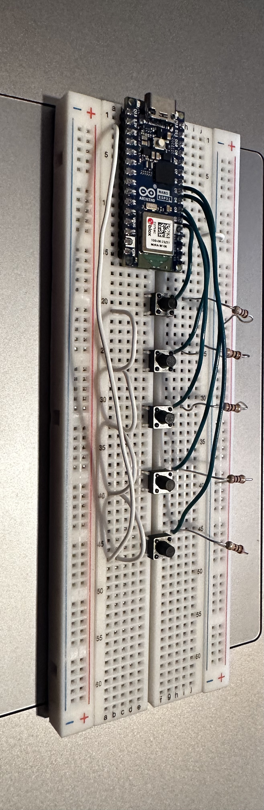
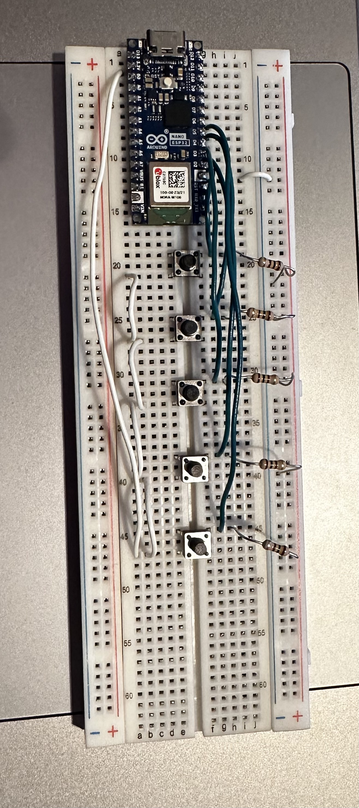
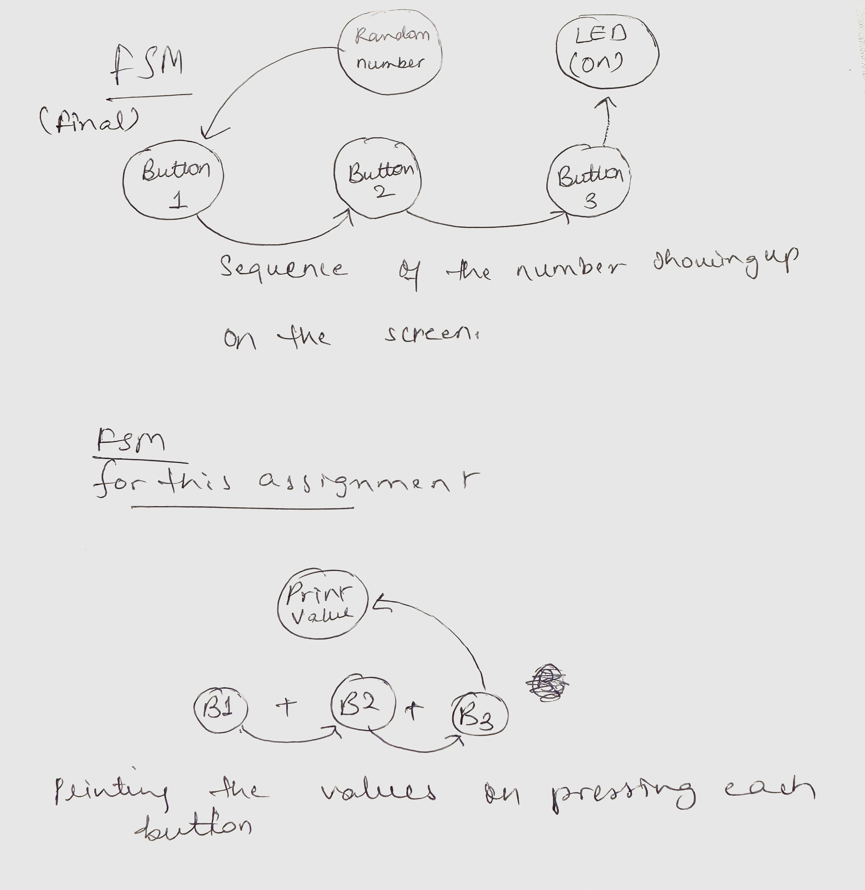

MEMORY GAME

For this project, I tried to create a memory game which could be used in schools and other educational institutions to help students work on their hand-eye cordination and the power to retain/observe a string of numbers or pattern and execute/ replicate the same with handson work with buttons.

I used p5js library along with arduino code to create buttons and numbers on the screen. There are numbers which flash on the screen and push buttons on the breadboard that correspond to those numbers flashing. Once the numbers flash (a sequence of 5 randomised numbers), the button to establish a serial conneciton pops up and once that is done, the player can enter the correct sequence of buttons by pushing the buttons on the breadboard. Once the correct sequence is followed, the screen turns green with the words YAY popping up, and if the player presses a wring button, the screen goes red to indicate the mistake.
Next steps to refine this would be to include another physical computing element,i.e., LEDs to indicate the correct sequece and the mistakes.

Circuit Diagram -

Circuit picture-

FSM-

Feedback from user testing-
The sequence works pretty well, the only constructive feedback was to inculde some way to have a certain time limit for the users to make it more challenging for the users.
